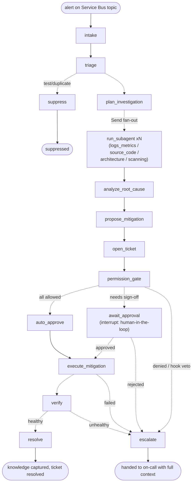

# SRE Agent — event-driven incident response with LangGraph

A standalone, event-driven SRE agent modeled on the workflow described in the
[Azure SRE Agent overview](https://learn.microsoft.com/en-us/azure/sre-agent/overview):
alerts land on an **Azure Service Bus topic**, the agent investigates through
purpose-built **subagents**, synthesizes a **root cause**, proposes mitigations
backed by **skills**, and pauses at a **permission gate** for human approval
before anything runs. Every investigation is written to an institutional
**knowledge store** so future incidents get faster answers.

This package is fully self-contained (`sre_agent/`), with its own
`requirements.txt` and tests. It runs completely offline out of the box:
heuristic analysis replaces the LLM when none is configured, tool clients
return representative mock data, and skill execution defaults to dry-run.

## The incident flow

Picture the 2:47 AM scenario from the Azure docs: a memory alert fires for
`payment-service`. Within one graph run the agent:

1. receives the alert from the Service Bus topic and normalizes it
   (Azure Monitor Common Alert Schema, PagerDuty v3, ServiceNow, or custom),
2. triages severity/category and pulls similar past incidents from knowledge,
3. plans the investigation and fans out to subagents in parallel:
   - **logs_metrics** finds the memory trend that started before the alert,
   - **source_code** finds the deployment two hours earlier,
   - **architecture** maps the blast radius,
   - **scanning** sweeps config/health state,
4. synthesizes a root cause ("memory pressure … introduced by deploy v2.14.0"),
5. proposes mitigations from the skill registry (rolling restart, HPA bump)
   plus a manual review of the correlated change,
6. creates a ticket prefilled with the whole investigation,
7. stops at the permission gate — prod changes require sign-off — and waits,
8. on approval, executes the skills, verifies health, resolves the ticket,
   and captures the investigation as knowledge.

## Workflow graph



Subagent fan-out uses LangGraph's **Send API** (map-reduce: findings merge via
an additive reducer), and approval uses **`interrupt()`** with a checkpointer,
so a paused investigation resumes exactly where it stopped when the human
decision arrives — from HTTP or from an `approval` message on the same topic.

## Mapping to Azure SRE Agent concepts

| Azure SRE Agent concept | Here | Where |
| --- | --- | --- |
| Incident trigger (PagerDuty/ServiceNow/Azure Monitor) | Service Bus **topic** subscription; payloads normalized per source | `triggers/`, `integrations/normalizers.py` |
| **Skills** (`SKILL.md` + manifest + attached tools) | Skill directories: `manifest.yaml` (name/description/files/tools) + `SKILL.md` procedural guidance + supporting `.md` files; loaded by relevance, max 5 active with LRU auto-unload; tools execute via dry-run/live executor | `skills/` |
| **Built-in subagents** (architecture, logs & metrics, source code, RCA, scanning) | Five built-in Python subagents + registry | `subagents/` |
| **Custom agents** (YAML: `system_prompt`, `handoff_description`, `allowed_skills`, `tools`, `enable_skills`) | YAML files in `subagents/custom/`; auto-registered; `allowed_skills` activates SKILL.md guidance | `subagents/custom_loader.py` |
| Python tools | Observability, deployment-correlation, ticketing clients | `tools/` |
| MCP servers | YAML server config + adapter loader | `mcp/` |
| **Agent hooks** (`Stop`, `PostToolUse` + prompt/command executors, `matcher`, `failMode`, `$ARGUMENTS`, stdin JSON context, exit-code-2 blocks) | Full hook contract incl. `{"ok"}`/`{"decision"}` responses and `additionalContext` injection; plus lifecycle events (investigation_started, before_mitigation, after_resolution, on_escalation) | `hooks/` |
| Permission gate | Policy rules (glob/risk/environment → allow/deny/require_approval) | `gate/` |
| **Synthesized knowledge** (`memories/synthesizedKnowledge/` markdown: always-loaded `overview.md` + topic files) | Same layout: `overview.md` (~2,000-char budget, linked topic index) + semantic topic `.md` files merged on update | `memory/synthesized.py` |
| **Session insights** (symptoms / resolution steps / root cause / pitfalls) | Generated after every resolve/escalate; persisted + merged into topic files | `memory/unified.py` |
| **User memories** (`#remember` / `#retrieve` / `#forget`) | `UserMemoryStore.remember/retrieve/forget` | `memory/user_memories.py` |
| **Knowledge base** (uploaded `.md`/`.txt` runbooks & docs) | Drop files in the knowledge-base dir (or `add_document`); searched with citations | `memory/knowledge_base.py` |
| **Unified memory search** (past incidents + memories + docs, cited) | One query across all sources, same-resource past incidents prioritized | `memory/unified.py` |
| Incident response plan | `response_plan.md` injected into planner/mitigation prompts | `response_plan.md` |
| Ticket with investigation summary | ServiceNow / PagerDuty / console ticketing | `tools/ticketing.py` |

## Event contract (Service Bus topic)

Topic: `sre-incidents` (configurable), subscription: `sre-agent`.

- **Alerts** — body: source-native JSON payload; application properties:
  `event_type=alert` (default), optional `source` hint
  (`azure_monitor` | `pagerduty` | `servicenow` | `custom`).
- **Approvals** — `event_type=approval`; body:
  `{"incident_id": "...", "approved": true, "approver": "...", "reason": "..."}`.
  Resumes the paused graph thread. Approvals can also arrive over HTTP
  (`POST /api/incidents/{id}/approval` on the Functions surface).

## Running it

```bash
pip install -r sre_agent/requirements.txt

# End-to-end local simulation (no Azure, no LLM needed)
python -m sre_agent.main simulate sre_agent/samples/azure_monitor_alert.json --approve

# Continuous listener against a real Service Bus topic
export SRE_AGENT_SERVICEBUS_CONNECTION_STRING="Endpoint=sb://..."
python -m sre_agent.main listen

# Print the compiled graph as mermaid
python -m sre_agent.main graph

# Tests
python -m pytest sre_agent/tests -q
```

The Azure Functions surface (`triggers/function_app.py`) provides the same
behavior serverlessly: a Service Bus **topic trigger** for alerts/approvals and
HTTP endpoints for approval + status.

## Configuration

Environment variables (prefix `SRE_AGENT_`, see `config.py`):

| Variable | Default | Purpose |
| --- | --- | --- |
| `SRE_AGENT_SERVICEBUS_CONNECTION_STRING` | — | Topic trigger connection |
| `SRE_AGENT_SERVICEBUS_TOPIC` / `_SUBSCRIPTION` | `sre-incidents` / `sre-agent` | Topic/subscription names |
| `SRE_AGENT_AUTONOMOUS_MODE` | `false` | Reviewed mode (default) vs. auto-approving low-risk actions |
| `SRE_AGENT_DRY_RUN` | `true` | Log skill commands instead of executing |
| `SRE_AGENT_TICKET_PLATFORM` | `console` | `servicenow` / `pagerduty` / `console` |
| `SRE_AGENT_AZURE_OPENAI_ENDPOINT` / `_API_KEY` / `_DEPLOYMENT` | — | Enable LLM reasoning (heuristics otherwise) |
| `SRE_AGENT_DATABASE_URL` | — | Postgres checkpointer for durable approvals |

## Extending the agent

- **Add a skill**: create a directory under `skills/builtin/` with a
  `manifest.yaml` (name, description, `files`, `tools`) and a `SKILL.md`
  containing the procedural guidance. Attach tools (azure_cli / shell /
  kusto / link) in the manifest — the agent loads the skill by relevance
  and can execute its tools. No code required.
- **Add a custom agent**: drop a YAML file in `subagents/custom/` with
  `name`, `system_prompt`, `handoff_description`, optional
  `allowed_skills` (auto-enables skills) and `tools`. It registers
  automatically and the planner can delegate to it. Python subclasses of
  `Subagent` are also supported for tool-heavy specialists.
- **Add a hook**: declare it in `hooks/hooks.yaml` — `Stop` validates the
  final response, `PostToolUse` (with a `matcher` regex) audits/blocks
  tool executions, and lifecycle events automate workflow milestones.
- **Teach it your environment**: upload runbooks/docs (`.md`/`.txt`) to the
  knowledge-base directory; save facts with `UserMemoryStore.remember()`;
  edit `response_plan.md` with your incident-handling instructions. The
  agent also writes its own `memories/synthesizedKnowledge/*.md` files as
  it resolves incidents.
- **Tighten/loosen the gate**: edit `gate/policies.yaml`. Deny rules always
  win; unmatched actions fall through to the default (`require_approval`).
- **Connect an MCP server**: enable an entry in `mcp/servers.yaml` and
  install `langchain-mcp-adapters`.

## Production hardening

Set `SRE_AGENT_ENVIRONMENT=production` to enable strict mode. What changes:

- **No silent degradation**: missing/failed LLM raises instead of falling
  back to heuristics; failed telemetry queries raise instead of returning
  synthetic data (`MockDataForbiddenError`). Escape hatch:
  `SRE_AGENT_ALLOW_MOCK_DATA=true`.
- **Durable checkpointer required**: startup fails without
  `SRE_AGENT_DATABASE_URL` (Postgres) — `MemorySaver` silently loses paused
  approvals on restart/scale-out. State models are registered with the
  checkpoint serializer so resume survives langgraph upgrades.
- **Verified approver identity required**: HTTP approvals must carry the
  Entra `X-MS-CLIENT-PRINCIPAL` header (App Service Authentication);
  body-supplied approver names are rejected.

Always-on protections (any environment):

- **Idempotent intake**: an alert ledger claims each `alert_id` atomically —
  Service Bus at-least-once redeliveries map back to the original incident
  instead of spawning duplicate investigations/tickets.
- **Storm suppression**: after `SRE_AGENT_STORM_THRESHOLD` alerts for the
  same service+alert within `SRE_AGENT_STORM_WINDOW_SECONDS`, further ones
  are suppressed and linked to the parent incident.
- **Approval timeouts**: a sweeper (Functions timer / listener loop)
  escalates investigations that waited longer than
  `SRE_AGENT_APPROVAL_TIMEOUT_SECONDS`, so nothing hangs forever.
- **LLM throttling**: a global concurrency semaphore
  (`SRE_AGENT_LLM_MAX_CONCURRENCY`) plus retry with exponential backoff
  bound spend and survive 429s during storms.
- **Fast-ack listener**: messages are completed after parsing (dedup makes
  that safe), so the Service Bus lock can't expire mid-investigation;
  unparseable payloads are dead-lettered with a reason.
- **Prompt-injection hygiene**: alert text and collected telemetry are
  sanitized and fenced in `<external_data>` blocks in every LLM prompt;
  autonomous mode never auto-approves actions in `prod` environments.
- **Execution safety**: missing binaries (az/kubectl) fail preflight with a
  clear error; `SRE_AGENT_EXECUTION_MODE=dispatch` hands approved actions
  to a separate privileged runner via the outbound topic instead of
  executing in-process (recommended on Functions).
- **Checkpoint retention**: threads older than
  `SRE_AGENT_CHECKPOINT_RETENTION_DAYS` are pruned (pending approvals are
  protected); concurrent writers to the markdown/JSONL stores are
  serialized with file locks (use NFS mounts, not SMB — or Postgres-backed
  stores, which kick in automatically when `SRE_AGENT_DATABASE_URL` is set).

Deployment guide for Azure Functions (plan choice, `host.json`, Azure Files
mount, Easy Auth): see [`deploy/README.md`](deploy/README.md).

Other notes:

- Swap the knowledge store's JSONL backend for pgvector/Azure AI Search for
  semantic recall at scale.
- Set `SRE_AGENT_DRY_RUN=false` only after reviewing the gate policy — the
  gate is the safety layer between a proposed action and a live command.
