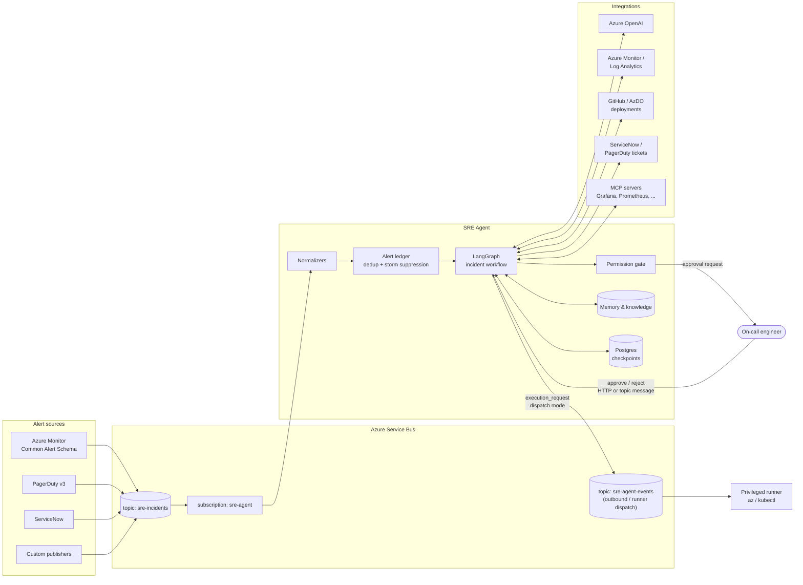
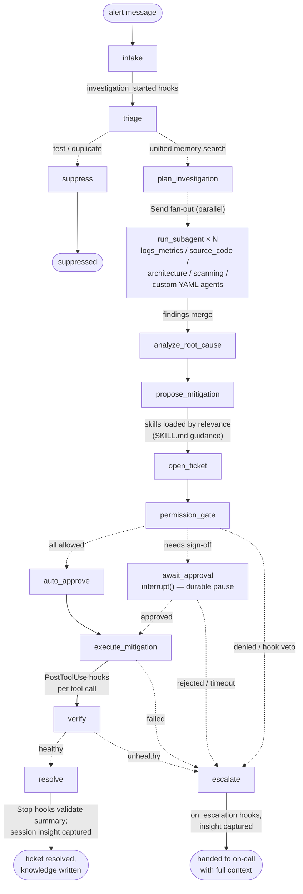
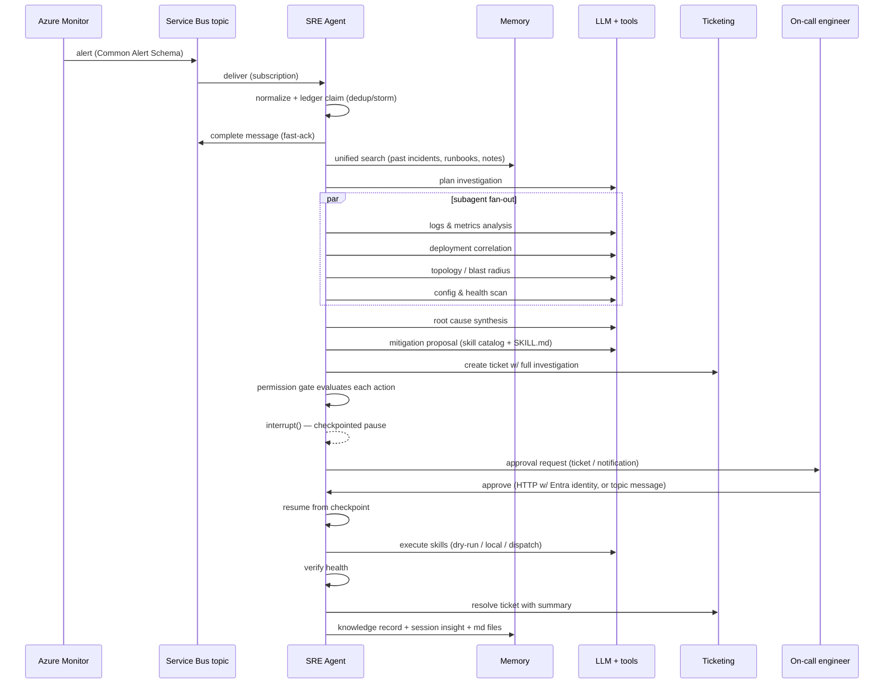
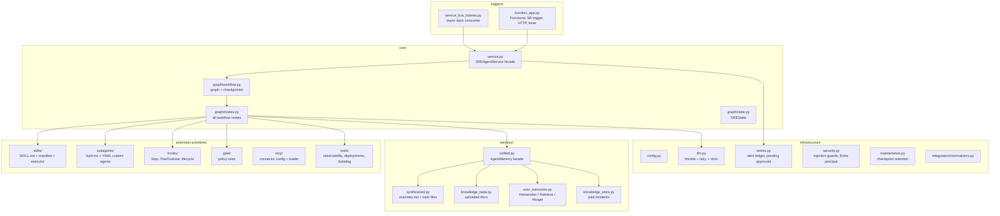
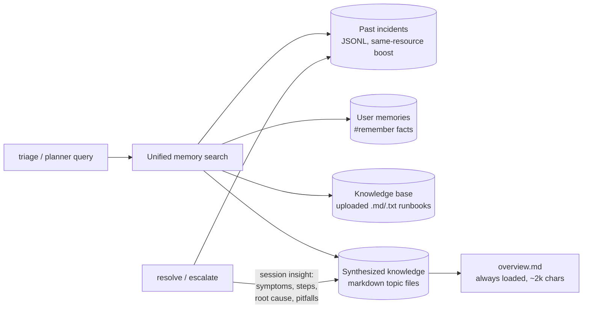

# SRE Agent — event-driven incident response with LangGraph

A standalone, event-driven SRE agent modeled on the workflow described in the
[Azure SRE Agent overview](https://learn.microsoft.com/en-us/azure/sre-agent/overview):
alerts land on an **Azure Service Bus topic**, the agent investigates through
purpose-built **subagents**, synthesizes a **root cause**, proposes mitigations
backed by **skills** (SKILL.md runbooks with attached tools), and pauses at a
**permission gate** for human approval before anything runs. Every
investigation is captured as **institutional knowledge** — markdown files,
session insights, and searchable past incidents — so the next incident gets
faster answers.

The package is fully self-contained (`sre_agent/`), with its own
`requirements.txt`, tests, and deployment guide. It runs completely offline
out of the box: heuristic analysis replaces the LLM when none is configured,
tool clients return representative mock data, and skill execution defaults to
dry-run. In production strict mode, every one of those fallbacks becomes a
loud failure instead.

---

## Table of contents

1. [What it does](#what-it-does)
2. [Architecture](#architecture)
   - [System context](#system-context)
   - [Incident workflow graph](#incident-workflow-graph)
   - [Incident sequence](#incident-sequence)
   - [Module map](#module-map)
3. [Concept parity with Azure SRE Agent](#concept-parity-with-azure-sre-agent)
4. [Extension primitives](#extension-primitives)
   - [Skills](#skills)
   - [Custom agents](#custom-agents)
   - [Python tools](#python-tools)
   - [MCP servers](#mcp-servers)
   - [Agent hooks](#agent-hooks)
   - [Permission gate](#permission-gate)
5. [Memory & knowledge](#memory--knowledge)
6. [Event contracts](#event-contracts)
7. [Reliability & safety](#reliability--safety)
8. [Configuration reference](#configuration-reference)
9. [Project structure](#project-structure)
10. [Getting started](#getting-started)
11. [Extending the agent](#extending-the-agent)
12. [Known limitations](#known-limitations)

---

## What it does

Picture the 2:47 AM scenario: a memory alert fires for `payment-service`.
Within one graph run the agent:

1. **receives** the alert from the Service Bus topic and normalizes it
   (Azure Monitor Common Alert Schema, PagerDuty v3, ServiceNow, or custom);
2. **triages** severity and category, and searches unified memory — past
   incidents on the same resource, user-saved facts, uploaded runbooks, and
   its own synthesized notes;
3. **plans** the investigation and fans out to subagents in parallel:
   - `logs_metrics` finds the memory trend that started 40 minutes before the alert,
   - `source_code` finds the deployment two hours earlier,
   - `architecture` maps the blast radius (which consumers are affected),
   - `scanning` sweeps configuration and health state;
4. **synthesizes** a root cause: *"memory pressure / leak … likely introduced
   by deploy v2.14.0"* with confidence and contributing factors;
5. **proposes** mitigations from the skill registry (rolling restart, HPA
   bump) plus a manual review of the correlated change;
6. **creates a ticket** prefilled with the entire investigation;
7. **stops at the permission gate** — production changes require sign-off —
   and waits (durably, via checkpoint) for a human decision;
8. on approval, **executes** the skills, **verifies** health, **resolves**
   the ticket, and **captures** the investigation as knowledge for next time.

If anything blocks — gate denial, hook veto, execution failure, unhealthy
verification, approval timeout — the incident **escalates** to a human with
everything the agent learned attached.

---

## Architecture

### System context



### Incident workflow graph

The graph is built with LangGraph. Subagent fan-out uses the **Send API**
(map-reduce: findings merge through an additive reducer), and human approval
uses **`interrupt()`** with a checkpointer, so a paused investigation resumes
exactly where it stopped — on any instance — when the decision arrives.



### Incident sequence



### Module map



---

## Concept parity with Azure SRE Agent

| Azure SRE Agent concept | Implementation here | Where |
| --- | --- | --- |
| Incident trigger (PagerDuty / ServiceNow / Azure Monitor) | Service Bus **topic** subscription; payloads normalized per source | `triggers/`, `integrations/normalizers.py` |
| **Skills** (`SKILL.md` + attached tools) | Single `SKILL.md` per skill: YAML frontmatter (name, description, tools) + markdown guidance body + supporting `.md` files; loaded by relevance, max 5 active with LRU auto-unload | `skills/` |
| **Built-in subagents** (architecture, logs & metrics, source code, RCA, scanning) | Five built-in Python subagents + registry | `subagents/` |
| **Custom agents** (`handoff_description`, `allowed_skills`, `tools`; body = system prompt) | Markdown files in `subagents/custom/` (frontmatter + prompt body), auto-registered; legacy YAML accepted | `subagents/custom_loader.py` |
| Python tools | Observability, deployment-correlation, ticketing clients | `tools/` |
| MCP servers | YAML server config + adapter loader | `mcp/` |
| **Agent hooks** (`Stop`, `PostToolUse`; prompt/command executors; `matcher`, `failMode`, `$ARGUMENTS`, exit-code-2 blocks) | Full documented contract + lifecycle events | `hooks/` |
| **Permission gate** (pre-execution safety layer) | Policy rules: glob / risk / environment → allow / deny / require_approval | `gate/` |
| **Synthesized knowledge** (`memories/synthesizedKnowledge/` markdown) | `overview.md` (always loaded, ~2,000-char budget) + semantic topic files merged on update | `memory/synthesized.py` |
| **Session insights** (symptoms / resolution / root cause / pitfalls) | Generated after every resolve **and** escalate | `memory/unified.py` |
| **User memories** (`#remember` / `#retrieve` / `#forget`) | `UserMemoryStore` | `memory/user_memories.py` |
| **Knowledge base** (uploaded `.md`/`.txt` docs) | Directory + search with citations | `memory/knowledge_base.py` |
| Unified memory search with citations | One query across all sources; same-resource incidents first | `memory/unified.py` |
| Incident response plan | `response_plan.md` injected into planner/mitigation prompts | `response_plan.md` |
| Run modes (Review / Autonomous) | `autonomous_mode` setting + gate policy (autonomy never applies in prod) | `config.py`, `gate/` |
| Ticket with investigation summary + approval action | ServiceNow / PagerDuty / console backends | `tools/ticketing.py` |

---

## Extension primitives

### Skills

A skill is a directory whose `SKILL.md` combines metadata and knowledge in
**one markdown file** — YAML frontmatter for the structured fields, markdown
body for the procedural guidance:

```
skills/builtin/aks-memory-pressure/
├── SKILL.md             # frontmatter (name, tools, ...) + guidance body
└── oomkill-runbook.md   # supporting reference material
```

```markdown
---
name: aks-memory-pressure
description: Use when investigating AKS/Kubernetes memory pressure, OOMKilled pods...
applies_to: [memory, oomkilled, crashloop, aks, kubernetes]
files: [SKILL.md, oomkill-runbook.md]
tools:
  - name: restart_aks_deployment
    type: shell
    command: "kubectl rollout restart deployment/{deployment} -n {namespace}"
    parameters: [namespace, deployment]
    risk: medium
  - name: get_pod_memory
    type: shell
    command: "kubectl top pods -n {namespace} --sort-by=memory"
    parameters: [namespace]
    risk: low
---
# AKS memory pressure troubleshooting

1. Confirm the trend: check `MemoryWorkingSet` over the last 90 minutes...
2. Check pod events for `OOMKilled` — run the `get_pod_memory` tool...
```

(A legacy layout with a separate `manifest.yaml` is still accepted.)

Behavior mirrored from the Azure model: the agent selects skills by
**relevance** (description/`applies_to` vs. the incident — no explicit
command), activating a skill loads its `SKILL.md` into reasoning prompts, at
most **5 skills are active** concurrently (oldest auto-unloads), and a
skill's tools are executable only while it's active (executing re-reads
`SKILL.md`). Parameters are shell-quoted when rendered into commands.

### Custom agents

Domain specialists defined in markdown — frontmatter for metadata, the
**body is the system prompt**. No code:

```markdown
---
# subagents/custom/database_expert.md
name: database_expert
handoff_description: Handles SQL and database troubleshooting (latency, pools, deadlocks)
allowed_skills: []          # setting this auto-enables skills
tools: [query_metrics, query_logs]
---
You are a database specialist. Analyze query performance, diagnose
connection issues and pool exhaustion, and recommend optimizations.
```

(Legacy plain-YAML definitions with a `system_prompt` field still load.)

Custom agents register alongside the built-ins; the planner sees their
`handoff_description` when composing an investigation, `allowed_skills`
activates SKILL.md guidance as evidence, and their findings merge into the
same state as everyone else's. Python subclasses of `Subagent` are also
supported for tool-heavy specialists.

### Python tools

Plain async clients in `tools/`: `ObservabilityClient` (Azure Monitor
metrics + Log Analytics KQL), `DeploymentClient` (recent deployments and
commits), `TicketClient` (ServiceNow / PagerDuty / console). Each has a live
mode and a mock mode; in production strict mode the mock paths raise instead.

### MCP servers

`mcp/servers.yaml` declares connections (Grafana, Prometheus, GitHub, …);
enabled entries are loaded through `langchain-mcp-adapters` and become tools
subagents can call. Credentials come from `${ENV_VAR}` references, never
inline.

### Agent hooks

Custom checkpoints intercepting agent behavior, with the documented contract:

| Event | Fires when | Can |
| --- | --- | --- |
| `Stop` | agent about to finalize its summary | reject with a reason (summary amended) |
| `PostToolUse` | a skill tool finished (matcher-filtered) | audit, block, inject `additionalContext` |
| `investigation_started`, `before_mitigation`, `after_resolution`, `on_escalation` | workflow milestones | notify, veto mitigation, emit telemetry |

Two executors: **prompt** (LLM evaluates; `$ARGUMENTS` injects the JSON
context) and **command** (shell command or shebang script; context on stdin).
Responses: `{"ok": true/false, "reason"}` or
`{"decision": "allow"/"block", "reason", "hookSpecificOutput":
{"additionalContext"}}`; exit code `2` always blocks with stderr as the
reason; other failures follow `failMode`. Shipped hooks: tool-usage audit,
dangerous-command blocker (`rm -rf`, `sudo`, …), resolution-completeness
check.

### Permission gate

Every proposed tool call is evaluated **before** execution against
`gate/policies.yaml`:

```yaml
default: require_approval
rules:
  - {name: block-destructive,        action: "*delete*",   decision: deny}
  - {name: allow-low-risk-nonprod,   risk: [low], environment: [dev, staging], decision: allow}
  - {name: allow-restarts-nonprod,   action: "restart_*",  environment: [dev, staging], decision: allow}
  - {name: prod-requires-approval,   environment: [prod],  decision: require_approval}
```

Deny rules always win; unmatched actions fall through to the default.
`autonomous_mode` may auto-allow **low-risk** unmatched actions — never in
`prod`.

---

## Memory & knowledge



Four sources, one query, results carry **citations** (record id / file name):

- **Past incidents** — every investigation writes a `KnowledgeRecord`;
  triage searches them with a same-service boost ("how did we fix this
  before?").
- **User memories** — discrete facts via `remember()` / `retrieve()` /
  `forget()` ("Production uses 3 AKS clusters in West US 2").
- **Knowledge base** — drop runbooks and architecture docs (`.md`/`.txt`)
  into the knowledge-base directory; searched automatically, cited by file.
- **Synthesized knowledge** — the agent's own markdown notes in
  `memories/synthesizedKnowledge/`: `overview.md` is loaded into every
  planning prompt (2,000-character budget) and links semantic topic files
  (`debugging-payment-service.md`, `architecture.md`, …) that merge new
  insights on update.

After every resolved **or** escalated incident the agent generates a
**session insight** (symptoms observed, resolution steps, root cause,
pitfalls to avoid), appends it to the insight log, and merges it into the
right topic file — so knowledge compounds whether or not the automation
succeeded.

---

## Event contracts

### Service Bus (inbound topic, default `sre-incidents`)

| `application_properties` | Body | Effect |
| --- | --- | --- |
| `event_type=alert` (default), optional `source` hint (`azure_monitor` \| `pagerduty` \| `servicenow` \| `custom`) | source-native alert JSON | starts an investigation (idempotent per `alert_id`) |
| `event_type=approval` | `{"incident_id", "approved", "approver", "reason"}` | resumes a paused investigation (topic send rights = credential; lock down with RBAC) |

### Service Bus (outbound topic, default `sre-agent-events`)

| `event_type` | Body | Emitted when |
| --- | --- | --- |
| `execution_request` | `{"action_id", "skill", "tool", "command", "risk"}` | `execution_mode=dispatch`: approved actions handed to a privileged runner |

### HTTP (Functions surface)

| Route | Method | Purpose |
| --- | --- | --- |
| `/api/incidents/{id}/approval` | POST | approve/reject; approver = verified Entra principal from `X-MS-CLIENT-PRINCIPAL` (401 without it in production) |
| `/api/incidents/{id}` | GET | status of a running/paused/finished incident |

A timer trigger (`ApprovalSweep`, every 5 minutes) escalates approvals past
`approval_timeout_seconds` and prunes old checkpoints.

---

## Observability

Every workflow node, tool execution, LLM call, and intake/approval event
emits a **structured step record** (step, status, `incident_id`,
`duration_ms`, service, outcome). With `APPLICATIONINSIGHTS_CONNECTION_STRING`
set and `azure-monitor-opentelemetry` installed, `configure_telemetry()`
(called automatically by every trigger surface) exports:

- step logs → App Insights **traces** with the fields as `customDimensions`,
- OpenTelemetry spans (per node, per skill tool, per LLM call) →
  **dependencies**, giving a timing waterfall per incident.

Reconstruct any incident's timeline with one KQL query:

```kusto
traces
| where customDimensions.incident_id == "sre-3f0f3c7841"
| project timestamp, step = customDimensions.step,
          status = customDimensions.status,
          duration_ms = customDimensions.duration_ms
| order by timestamp asc
```

Steps logged: `alert_intake` (accepted / duplicate / storm_suppressed),
every graph node (completed / paused / failed, with durations),
`approval_request` / `approval_decision` / `approval_timeout`,
`skill_tool_execution`, and `llm_call` (attempts + retries). Without App
Insights configured everything degrades to plain local logging — offline
dev and CI need nothing.

## Reliability & safety

| Protection | Mechanism |
| --- | --- |
| Duplicate investigations (at-least-once delivery) | atomic **alert ledger** claim per `alert_id` (Postgres `ON CONFLICT` or file+lock); redeliveries map to the original incident |
| Alert storms | same service+alert suppressed past `storm_threshold` within `storm_window_seconds`, linked to the parent incident |
| Lock expiry mid-investigation | **fast-ack**: message completed right after parse (safe because intake is idempotent) |
| Poison messages | dead-lettered immediately with a reason |
| Hung approvals | pending-approval registry + sweeper escalates past the timeout |
| Lost approvals on restart/scale-out | Postgres checkpointer **required** in production (startup fails without it); state models registered with the serializer |
| Silent degradation | strict mode: missing LLM → `LLMUnavailableError`; failed telemetry → `MockDataForbiddenError` (never synthetic data behind a real mitigation) |
| LLM cost/429s under storm | global concurrency semaphore + exponential-backoff retries |
| Forged approvals | Entra-verified approver identity required in production; body-supplied names rejected |
| Prompt injection via alert content | alert text/telemetry sanitized + fenced in `<external_data>` blocks with an explicit don't-follow-instructions caution in every prompt |
| Dangerous commands | permission gate (name/risk/environment policy) + PostToolUse blocker hook + shell-quoted parameters + autonomy never in prod |
| Missing executables (Functions sandbox) | binary preflight with a clear error; `dispatch` mode hands execution to a privileged runner via the outbound topic |
| Unbounded checkpoint growth | retention pruning (`checkpoint_retention_days`), pending approvals protected |
| Concurrent store writes | advisory file locks (use NFS, not SMB) or Postgres-backed stores when `database_url` is set |

---

## Configuration reference

All settings via environment variables with prefix `SRE_AGENT_` (see
`config.py`).

| Variable | Default | Purpose |
| --- | --- | --- |
| `ENVIRONMENT` | `development` | `production` enables strict mode (no mocks, durable checkpointer, verified identity) |
| `SERVICEBUS_CONNECTION_STRING` | — | Service Bus connection |
| `SERVICEBUS_TOPIC` / `SERVICEBUS_SUBSCRIPTION` | `sre-incidents` / `sre-agent` | inbound topic/subscription |
| `SERVICEBUS_OUTBOUND_TOPIC` | `sre-agent-events` | outcomes + runner dispatch |
| `AZURE_OPENAI_ENDPOINT` / `AZURE_OPENAI_API_KEY` / `AZURE_OPENAI_DEPLOYMENT` / `AZURE_OPENAI_API_VERSION` | — | LLM (heuristics used when unset, dev only) |
| `OPENAI_API_KEY` / `OPENAI_MODEL` | — / `gpt-4o-mini` | non-Azure OpenAI alternative |
| `AUTONOMOUS_MODE` | `false` | gate may auto-allow low-risk unmatched actions (never in prod) |
| `DRY_RUN` | `true` | render + log skill commands instead of executing |
| `EXECUTION_MODE` | `local` | `dispatch` publishes approved actions to the outbound topic |
| `APPROVAL_TIMEOUT_SECONDS` | `900` | sweeper escalates paused investigations after this |
| `APPROVAL_REQUIRE_VERIFIED_IDENTITY` | prod: `true` | require Entra principal on HTTP approvals |
| `STORM_THRESHOLD` / `STORM_WINDOW_SECONDS` | `5` / `300` | storm suppression |
| `LLM_MAX_CONCURRENCY` / `LLM_RETRY_ATTEMPTS` / `LLM_RETRY_BASE_DELAY_SECONDS` | `4` / `3` / `2.0` | LLM throttling |
| `DATA_DIR` | `data` | base dir for all mutable state — durable shared mount in production |
| `KNOWLEDGE_PATH` / `MEMORIES_DIR` / `KNOWLEDGE_BASE_DIR` | derived from `DATA_DIR` | per-store overrides |
| `DATABASE_URL` | — | Postgres: checkpointer + alert ledger + pending approvals |
| `CHECKPOINT_RETENTION_DAYS` | `14` | prune finished threads older than this |
| `ALLOW_MOCK_DATA` | dev: `true`, prod: `false` | explicit override for mock fallbacks |
| `TICKET_PLATFORM` | `console` | `servicenow` \| `pagerduty` \| `console` (+ platform credentials) |
| `SKILLS_DIR` / `CUSTOM_AGENTS_DIR` / `HOOKS_FILE` / `GATE_POLICY_FILE` / `MCP_SERVERS_FILE` / `RESPONSE_PLAN_FILE` | package defaults | extension primitive locations |

---

## Project structure

```
sre_agent/
├── README.md                  # this document
├── requirements.txt           # standalone dependencies
├── response_plan.md           # operator instructions injected into prompts
├── config.py                  # pydantic-settings (SRE_AGENT_*)
├── models.py                  # all pydantic domain models
├── service.py                 # SREAgentService facade (all triggers use it)
├── llm.py                     # LLM access: throttle, retry, strict mode
├── security.py                # injection guards, Entra principal parsing
├── stores.py                  # alert ledger + pending approvals (pg/file)
├── locking.py                 # advisory file locks
├── maintenance.py             # checkpoint retention
├── main.py                    # CLI: listen / simulate / graph
├── graph/
│   ├── state.py               # SREState (additive reducers for fan-out)
│   ├── nodes.py               # all workflow nodes (DI for every dependency)
│   └── workflow.py            # graph wiring + checkpointer factory
├── subagents/
│   ├── base.py                # collect() + analyze() template
│   ├── logs_metrics.py / source_code.py / architecture.py / scanning.py
│   ├── root_cause.py          # synthesis subagent
│   ├── custom_loader.py       # markdown custom agents (legacy YAML too)
│   ├── custom/                # drop custom agent .md files here
│   └── registry.py
├── frontmatter.py             # markdown frontmatter parsing (skills/agents)
├── skills/
│   ├── registry.py            # SKILL.md loading, relevance, 5-active LRU
│   ├── executor.py            # dry-run / local / dispatch + PostToolUse
│   └── builtin/<skill>/       # SKILL.md (frontmatter+body) + supporting files
├── hooks/
│   ├── engine.py              # Stop / PostToolUse / lifecycle contract
│   └── hooks.yaml
├── gate/
│   ├── permission_gate.py
│   └── policies.yaml
├── memory/
│   ├── unified.py             # AgentMemory: unified search + insights
│   ├── synthesized.py         # overview.md + topic markdown files
│   ├── knowledge_base.py      # uploaded docs
│   ├── user_memories.py       # #remember / #retrieve / #forget
│   └── knowledge_store.py     # past incidents
├── tools/
│   ├── observability.py / deployments.py / ticketing.py
├── mcp/
│   ├── servers.yaml / loader.py
├── integrations/
│   └── normalizers.py         # Azure Monitor / PagerDuty / ServiceNow / custom
├── triggers/
│   ├── service_bus_listener.py  # always-on consumer (fast-ack, DLQ, sweep)
│   └── function_app.py          # Azure Functions surface
├── deploy/
│   ├── README.md              # full deployment guide with commands
│   └── host.json              # tuned Functions host configuration
├── samples/                   # example alert payloads
└── tests/                     # 60 offline tests
```

---

## Getting started

```bash
pip install -r sre_agent/requirements.txt

# End-to-end local simulation (no Azure, no LLM needed)
python -m sre_agent.main simulate sre_agent/samples/azure_monitor_alert.json --approve

# Continuous listener against a real Service Bus topic
export SRE_AGENT_SERVICEBUS_CONNECTION_STRING="Endpoint=sb://..."
python -m sre_agent.main listen

# Print the compiled graph as mermaid
python -m sre_agent.main graph

# Tests
python -m pytest sre_agent/tests -q
```

The simulation runs the full flow — triage, four-subagent fan-out, root
cause, mitigation proposal, ticket, gate pause, approval, dry-run execution,
verification, knowledge capture — and prints the final state. Run it twice
and the second run returns `duplicate` (idempotent intake).

For production deployment (Azure Functions, Service Bus, Postgres, Azure
Files, Easy Auth) see **[deploy/README.md](deploy/README.md)**.

---

## Extending the agent

- **Add a skill** — create `skills/builtin/<name>/SKILL.md`: frontmatter
  with `name`, `description`, `applies_to`, and `tools`; guidance in the
  body. No code required.
- **Add a custom agent** — drop a markdown file in `subagents/custom/`:
  frontmatter with `name`, `handoff_description`, optional `allowed_skills`
  and `tools`; the body is the system prompt. Registers automatically.
- **Add a hook** — declare it in `hooks/hooks.yaml` (`Stop`, `PostToolUse`
  with `matcher`, or a lifecycle event; `prompt` or `command` executor).
- **Teach it your environment** — upload runbooks to the knowledge base,
  save facts with `UserMemoryStore.remember()`, edit `response_plan.md`.
  The agent also writes its own knowledge files as it works.
- **Tune the gate** — edit `gate/policies.yaml`; deny always wins.
- **Connect an MCP server** — enable an entry in `mcp/servers.yaml` and
  install `langchain-mcp-adapters`.
- **Swap a dependency** — every node dependency (skills, gate, hooks,
  memory, tickets, executor, observability) is constructor-injected on
  `SREAgentNodes`; replace any of them without touching the graph.

---

## Known limitations

- **Stop-hook semantics are adapted, not identical**: in the Azure chat
  agent a Stop rejection forces the agent to keep working; in this
  structured graph a rejection amends the resolution summary with the
  missing detail (there is no open-ended chat turn to resume).
- **Dispatch mode weakens immediate verification**: execution results come
  back as "dispatched"; verification should consume the runner's completion
  events (runner not included in this package).
- **Keyword-based retrieval**: memory search is keyword-overlap; swap in
  pgvector / Azure AI Search for semantic recall at scale.
- **File locks are advisory**: fine on local disk and NFS; unreliable on SMB
  mounts — prefer the Postgres-backed stores (automatic when
  `DATABASE_URL` is set).
- **English-only prompts**, mirroring the reference product's current state.
