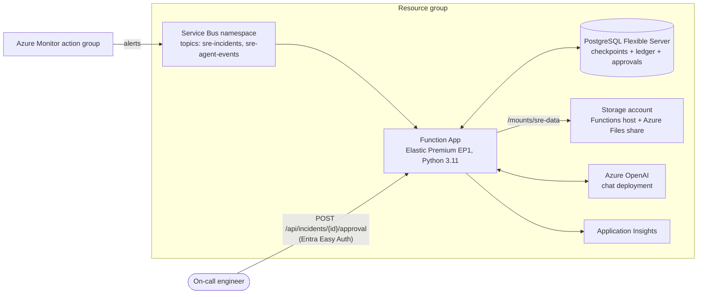

# Deployment guide — SRE Agent on Azure Functions

Step-by-step provisioning and deployment for the production topology:



> **Plan choice**: this guide uses **Elastic Premium (EP1)** because it
> supports long executions, pre-warmed instances, and Azure Files mounts
> with stable CLI syntax. Flex Consumption also works if approved in your
> org — adjust the `functionapp create` step accordingly.
> Azure CLI evolves; commands below are current as of mid-2026 — check
> `az functionapp create --help` if a flag is rejected.

---

## 0. Prerequisites

- Azure CLI ≥ 2.60 (`az login` done, subscription selected)
- Azure Functions Core Tools v4 (`func --version`)
- Python 3.11 locally
- Permission to create: Service Bus, Functions, Postgres, Storage,
  Cognitive Services, app registrations (for Easy Auth)

Set the variables used throughout:

```bash
export SUBSCRIPTION_ID="$(az account show --query id -o tsv)"
export LOCATION="eastus2"
export RG="rg-sre-agent-prod"
export SB_NAMESPACE="sb-sre-agent-prod"        # must be globally unique
export TOPIC_IN="sre-incidents"
export TOPIC_OUT="sre-agent-events"
export SB_SUB="sre-agent"
export PG_SERVER="pg-sre-agent-prod"           # must be globally unique
export PG_ADMIN="sreadmin"
export PG_PASSWORD="$(openssl rand -base64 24)" # store in Key Vault!
export PG_DB="sreagent"
export STORAGE="stsreagentprod$RANDOM"          # must be globally unique
export FILESHARE="sre-data"
export PLAN="plan-sre-agent-ep1"
export APP="func-sre-agent-prod"                # must be globally unique
export AOAI="aoai-sre-agent-prod"               # must be globally unique
export AOAI_DEPLOYMENT="gpt-5.1-codex"
```

---

## 1. Resource group

```bash
az group create --name "$RG" --location "$LOCATION"
```

## 2. Service Bus (topics + subscription)

Topics require the **Standard** tier or above.

```bash
az servicebus namespace create \
  --resource-group "$RG" --name "$SB_NAMESPACE" \
  --location "$LOCATION" --sku Standard

# Inbound topic (alerts + approval messages)
az servicebus topic create \
  --resource-group "$RG" --namespace-name "$SB_NAMESPACE" \
  --name "$TOPIC_IN" \
  --default-message-time-to-live P1D \
  --enable-duplicate-detection true \
  --duplicate-detection-history-time-window PT10M

# The agent's subscription (max-delivery 5 -> then dead-letter)
az servicebus topic subscription create \
  --resource-group "$RG" --namespace-name "$SB_NAMESPACE" \
  --topic-name "$TOPIC_IN" --name "$SB_SUB" \
  --max-delivery-count 5 \
  --enable-dead-lettering-on-message-expiration true

# Outbound topic (agent outcomes / runner dispatch)
az servicebus topic create \
  --resource-group "$RG" --namespace-name "$SB_NAMESPACE" \
  --name "$TOPIC_OUT"

# Connection string (least-privilege alternative: managed identity +
# 'Azure Service Bus Data Receiver/Sender' role assignments)
export SB_CONN="$(az servicebus namespace authorization-rule keys list \
  --resource-group "$RG" --namespace-name "$SB_NAMESPACE" \
  --name RootManageSharedAccessKey \
  --query primaryConnectionString -o tsv)"
```

> Duplicate detection at the namespace level is a second dedup layer for
> publishers that set `MessageId = alert id`; the agent's alert ledger
> dedupes regardless.

## 3. PostgreSQL Flexible Server

Holds the LangGraph checkpoints, the alert ledger, and the pending-approval
registry.

```bash
az postgres flexible-server create \
  --resource-group "$RG" --name "$PG_SERVER" \
  --location "$LOCATION" \
  --tier Burstable --sku-name Standard_B1ms \
  --storage-size 32 --version 16 \
  --admin-user "$PG_ADMIN" --admin-password "$PG_PASSWORD" \
  --public-access 0.0.0.0   # Azure-services-only; use VNet integration for real prod

az postgres flexible-server db create \
  --resource-group "$RG" --server-name "$PG_SERVER" --database-name "$PG_DB"

export DATABASE_URL="postgresql://${PG_ADMIN}:${PG_PASSWORD}@${PG_SERVER}.postgres.database.azure.com:5432/${PG_DB}?sslmode=require"
```

> Sizing: B1ms is fine to start. Watch connection counts as you scale out —
> each instance opens checkpointer connections; add PgBouncer (built into
> Flexible Server as the `pgbouncer` feature) if you exceed ~50 connections.

## 4. Storage account + Azure Files share

One storage account serves as the Functions host storage; the file share is
the durable mount for the agent's markdown knowledge and memory files.

```bash
az storage account create \
  --resource-group "$RG" --name "$STORAGE" \
  --location "$LOCATION" --sku Standard_LRS --kind StorageV2

az storage share-rm create \
  --resource-group "$RG" --storage-account "$STORAGE" \
  --name "$FILESHARE" --quota 16

export STORAGE_KEY="$(az storage account keys list \
  --resource-group "$RG" --account-name "$STORAGE" \
  --query '[0].value' -o tsv)"
```

> The agent's file locks are advisory (fcntl) and unreliable over SMB. The
> high-contention stores (alert ledger, pending approvals) use Postgres
> automatically once `DATABASE_URL` is set, so the share only carries the
> low-contention markdown/knowledge files — acceptable over SMB. For strict
> correctness use an NFS share (premium `FileStorage` account) instead.

## 5. Azure OpenAI

```bash
az cognitiveservices account create \
  --resource-group "$RG" --name "$AOAI" \
  --location "$LOCATION" --kind OpenAI --sku S0

az cognitiveservices account deployment create \
  --resource-group "$RG" --name "$AOAI" \
  --deployment-name "$AOAI_DEPLOYMENT" \
  --model-format OpenAI --model-name gpt-5.1-codex --model-version "default" \
  --sku-name Standard --sku-capacity 50   # 50K TPM — size to your storm ceiling

export AOAI_ENDPOINT="$(az cognitiveservices account show \
  --resource-group "$RG" --name "$AOAI" --query properties.endpoint -o tsv)"
export AOAI_KEY="$(az cognitiveservices account keys list \
  --resource-group "$RG" --name "$AOAI" --query key1 -o tsv)"
```

## 6. Function App (Elastic Premium, Python 3.11)

```bash
az functionapp plan create \
  --resource-group "$RG" --name "$PLAN" \
  --location "$LOCATION" --sku EP1 --is-linux true

az functionapp create \
  --resource-group "$RG" --name "$APP" \
  --plan "$PLAN" --storage-account "$STORAGE" \
  --runtime python --runtime-version 3.11 --functions-version 4 \
  --os-type Linux

# Application Insights is created automatically; keep one pre-warmed
# instance so 2:47 AM alerts don't pay a cold start:
az functionapp plan update --resource-group "$RG" --name "$PLAN" \
  --min-instances 1
```

Mount the Azure Files share at `/mounts/sre-data`:

```bash
az webapp config storage-account add \
  --resource-group "$RG" --name "$APP" \
  --custom-id sre-data \
  --storage-type AzureFiles \
  --account-name "$STORAGE" --share-name "$FILESHARE" \
  --access-key "$STORAGE_KEY" \
  --mount-path /mounts/sre-data
```

## 7. Application settings

```bash
az functionapp config appsettings set \
  --resource-group "$RG" --name "$APP" --settings \
  SRE_AGENT_ENVIRONMENT="production" \
  SRE_AGENT_SERVICEBUS_CONNECTION_STRING="$SB_CONN" \
  SRE_AGENT_SERVICEBUS_TOPIC="$TOPIC_IN" \
  SRE_AGENT_SERVICEBUS_SUBSCRIPTION="$SB_SUB" \
  SRE_AGENT_SERVICEBUS_OUTBOUND_TOPIC="$TOPIC_OUT" \
  SRE_AGENT_DATABASE_URL="$DATABASE_URL" \
  SRE_AGENT_DATA_DIR="/mounts/sre-data" \
  SRE_AGENT_AZURE_OPENAI_ENDPOINT="$AOAI_ENDPOINT" \
  SRE_AGENT_AZURE_OPENAI_API_KEY="$AOAI_KEY" \
  SRE_AGENT_AZURE_OPENAI_DEPLOYMENT="$AOAI_DEPLOYMENT" \
  SRE_AGENT_EXECUTION_MODE="dispatch" \
  SRE_AGENT_DRY_RUN="true" \
  SRE_AGENT_TICKET_PLATFORM="console" \
  SRE_AGENT_APPROVAL_TIMEOUT_SECONDS="900" \
  SRE_AGENT_LLM_MAX_CONCURRENCY="4"
```

Notes:

- **Secrets belong in Key Vault**: replace raw values with Key Vault
  references, e.g.
  `SRE_AGENT_DATABASE_URL=@Microsoft.KeyVault(SecretUri=https://<vault>.vault.azure.net/secrets/pg-url/)`.
- `SRE_AGENT_DRY_RUN=true` keeps executions simulated. Flip to `false`
  only after the gate policy review, and keep `EXECUTION_MODE=dispatch` on
  Functions (the sandbox has no az/kubectl or credentials — a separate
  privileged runner consumes `execution_request` events from `$TOPIC_OUT`).
- For ServiceNow/PagerDuty ticketing set `SRE_AGENT_TICKET_PLATFORM` and
  the matching credentials (see the configuration reference in the main
  README).

## 8. Build and publish the code

The Functions project needs `host.json` + `requirements.txt` at its root and
the v2-model `function_app.py`:

```bash
cd /path/to/SupportAgent
rm -rf build/functionapp && mkdir -p build/functionapp
cp sre_agent/deploy/host.json build/functionapp/host.json
cp sre_agent/requirements.txt build/functionapp/requirements.txt
# production needs the Postgres checkpointer:
echo "langgraph-checkpoint-postgres>=2.0.0" >> build/functionapp/requirements.txt
cp -r sre_agent build/functionapp/sre_agent
cat > build/functionapp/function_app.py <<'EOF'
"""Azure Functions entry point: re-export the app from the package."""
from sre_agent.triggers.function_app import app  # noqa: F401
EOF

cd build/functionapp
func azure functionapp publish "$APP" --python
```

The tuned `host.json` in this directory sets:

| Setting | Value | Why |
| --- | --- | --- |
| `functionTimeout` | `00:30:00` | investigations exceed default timeouts |
| `serviceBus.maxAutoLockRenewalDuration` | `00:30:00` | the default renewal window is 5 min; past it a message unlocks and redelivers mid-run (the ledger dedupes it, but avoid it anyway) |
| `serviceBus.maxConcurrentCalls` | `4` | bounds parallel investigations per instance; with `SRE_AGENT_LLM_MAX_CONCURRENCY` caps storm spend |

## 9. Easy Auth (verified approver identity)

Approving a mitigation is privileged: in production the approval endpoint
requires the Entra principal from `X-MS-CLIENT-PRINCIPAL` and returns 401
without it.

```bash
# App registration for the Function App
export AUTH_APP_ID="$(az ad app create \
  --display-name "sre-agent-approvals" \
  --web-redirect-uris "https://${APP}.azurewebsites.net/.auth/login/aad/callback" \
  --query appId -o tsv)"
az ad app credential reset --id "$AUTH_APP_ID" --query password -o tsv \
  > /tmp/auth-secret.txt   # store in Key Vault, then delete this file

export TENANT_ID="$(az account show --query tenantId -o tsv)"

az webapp auth microsoft update \
  --resource-group "$RG" --name "$APP" \
  --client-id "$AUTH_APP_ID" \
  --client-secret "$(cat /tmp/auth-secret.txt)" \
  --tenant-id "$TENANT_ID" \
  --issuer "https://login.microsoftonline.com/${TENANT_ID}/v2.0"

az webapp auth update \
  --resource-group "$RG" --name "$APP" \
  --enabled true \
  --action AllowAnonymous   # SB-trigger + timer need no login; the approval
                            # endpoint itself enforces the principal header
rm -f /tmp/auth-secret.txt
```

> `--action AllowAnonymous` + in-code enforcement keeps non-interactive
> triggers working while the approval route demands identity. If you prefer
> platform-level enforcement, use `RedirectToLoginPage` and exclude paths.

## 10. Wire an alert source

Azure Monitor → action group → Service Bus topic:

```bash
az monitor action-group create \
  --resource-group "$RG" --name ag-sre-agent \
  --short-name sreagent \
  --action servicebus sre-topic \
    "/subscriptions/${SUBSCRIPTION_ID}/resourceGroups/${RG}/providers/Microsoft.ServiceBus/namespaces/${SB_NAMESPACE}/topics/${TOPIC_IN}" \
    usecommonalertschema
```

Attach `ag-sre-agent` to your metric/log alert rules with the **common alert
schema enabled** — the normalizer expects it. PagerDuty/ServiceNow publish
via their webhook→Service Bus integrations (or a tiny relay function),
setting `application_properties.source` accordingly.

---

## 11. Smoke test

Publish the sample alert to the topic:

```bash
pip install azure-servicebus
export SRE_AGENT_SERVICEBUS_CONNECTION_STRING="$SB_CONN"
python - <<'EOF'
import asyncio, json
from sre_agent.triggers.service_bus_listener import publish_alert
payload = json.load(open("sre_agent/samples/azure_monitor_alert.json"))
asyncio.run(publish_alert(payload, source="azure_monitor"))
print("alert published")
EOF
```

Watch it process:

```bash
func azure functionapp logstream "$APP"
# or: Application Insights > Live metrics
```

Expected: investigation runs, a ticket is logged, and the incident pauses
`awaiting_approval`. Grab the incident id from the logs, then approve
(as a signed-in Entra user / with an Easy Auth token):

```bash
curl -s -X POST \
  "https://${APP}.azurewebsites.net/api/incidents/<incident_id>/approval" \
  -H "Content-Type: application/json" \
  -H "Cookie: AppServiceAuthSession=<from browser login>" \
  -d '{"approved": true, "reason": "smoke test"}'

# status:
curl -s "https://${APP}.azurewebsites.net/api/incidents/<incident_id>"
```

Publish the same alert again — the response in the logs must be
`"status": "duplicate"` (idempotent intake).

---

## 12. Alternative: always-on listener (no Functions)

If a plan without long executions is all you have — or you prefer a plain
worker — run the listener under App Service (Basic+ with Always On):

```bash
az appservice plan create --resource-group "$RG" --name plan-sre-listener \
  --sku B1 --is-linux true
az webapp create --resource-group "$RG" --plan plan-sre-listener \
  --name "${APP}-listener" --runtime "PYTHON:3.11"
az webapp config appsettings set --resource-group "$RG" \
  --name "${APP}-listener" --settings \
  SCM_DO_BUILD_DURING_DEPLOYMENT=true \
  WEBSITES_CONTAINER_START_TIME_LIMIT=1800 \
  # ...same SRE_AGENT_* settings as step 7...
az webapp config set --resource-group "$RG" --name "${APP}-listener" \
  --startup-file "python -m sre_agent.main listen" --always-on true

# deploy: zip the repo (with sre_agent/) and push
zip -r /tmp/sre-agent.zip sre_agent requirements.txt
az webapp deploy --resource-group "$RG" --name "${APP}-listener" \
  --src-path /tmp/sre-agent.zip --type zip
```

The listener does its own fast-ack, dead-lettering, and approval sweeping —
no timer trigger needed. Approvals arrive as `event_type=approval` topic
messages (or add a small HTTP front if you want the REST endpoint).

---

## 13. Operations

| Task | How |
| --- | --- |
| Watch investigations | Application Insights traces; `func azure functionapp logstream $APP` |
| Inspect dead-lettered alerts | `az servicebus topic subscription show --resource-group $RG --namespace-name $SB_NAMESPACE --topic-name $TOPIC_IN --name $SB_SUB --query countDetails` then Service Bus Explorer (portal) on the DLQ |
| Timed-out approvals | escalated automatically by the `ApprovalSweep` timer (every 5 min); look for "Sweeper escalated" traces |
| Checkpoint growth | pruned by the same timer past `SRE_AGENT_CHECKPOINT_RETENTION_DAYS`; verify with `SELECT count(*) FROM checkpoints;` |
| Knowledge review | files on the share: `az storage file list --account-name $STORAGE --share-name $FILESHARE --path memories/synthesizedKnowledge -o table` |
| Rotate secrets | Key Vault references + `az functionapp restart` |
| Scale ceiling | `az functionapp plan update --max-burst`; raise `SRE_AGENT_LLM_MAX_CONCURRENCY` and Azure OpenAI capacity together |

## 14. Going live checklist

- [ ] `SRE_AGENT_ENVIRONMENT=production` (strict mode verified: deploy fails fast if Postgres is missing)
- [ ] Secrets in Key Vault, not raw app settings
- [ ] Gate policy (`gate/policies.yaml`) reviewed by the team that owns prod
- [ ] `response_plan.md` filled in with your escalation procedure
- [ ] Runbooks uploaded to the knowledge base directory on the share
- [ ] Easy Auth enforced and an approval smoke-tested end-to-end
- [ ] DLQ alert configured (active message count on the subscription's DLQ)
- [ ] Privileged runner deployed and consuming `execution_request` events **before** flipping `SRE_AGENT_DRY_RUN=false`
- [ ] Azure OpenAI capacity sized for your worst alert storm (`maxConcurrentCalls × LLM_MAX_CONCURRENCY × instances`)

## 15. Teardown

```bash
az group delete --name "$RG" --yes --no-wait
az ad app delete --id "$AUTH_APP_ID"
```
